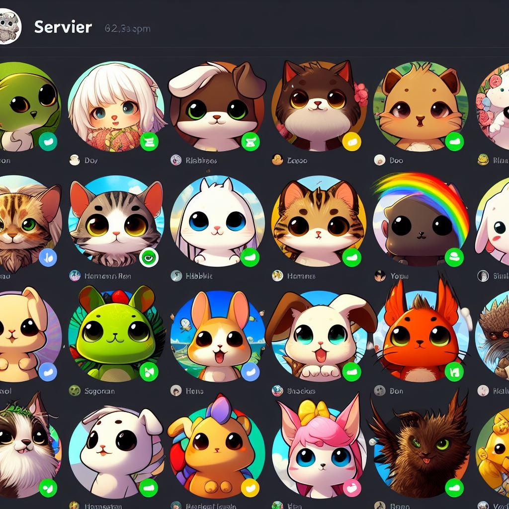
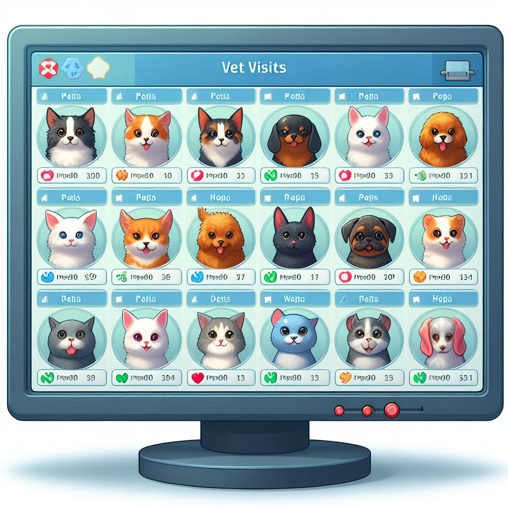

# apbd-lab-05

## REST API basics

#### Totally accurate representation of this task - totally not AI-generated (fr fr, trust me bro):

 

## I used MinimalApi to make it shorter and simpler

### API endpoints:

- GET
  
  - Gets list of stred animals: 
    ```
    /animals
    ```

  - Gets info about the animal of the given id:
    ```
    /animals/{animalId}
    ```

  - Gets the list of vet vists of the animal of the given id:
    ```
    /animals/{animalId}/visits
    ```
    

- POST 
  - Adds new animal - POST
    ```
    /animals
    ```
    Example request body:
      ```json
      {
        "id": 11,
        "name": "Lucky",
        "type": "Dog",
        "weight": 25,
        "color": "White"
      }
      ```

  - Adds a new visit for the animal of the given id:
    ```
    /animals/{animalId}/visits
    ```
    Example request body:
      ```json
      {
        "id": 1,
        "date": "2024-04-10T23:11:58.584Z",
        "animalId": 1,
        "description": "Check up",
        "cost": 100
      }
      ```
- PUT
  - Updates the animal of the given id:
    ```
    /animals/{animalId}
    ```
    Example request body:
      ```json
      {
        "id": 11,
        "name": "Lucky <3",
        "type": "Dog",
        "weight": 30,
        "color": "White"
      }
      ```
  - DELETE
    - Deletes the animal of the given id:
      ```
      /animals/{animalId}
      ```
      

    

